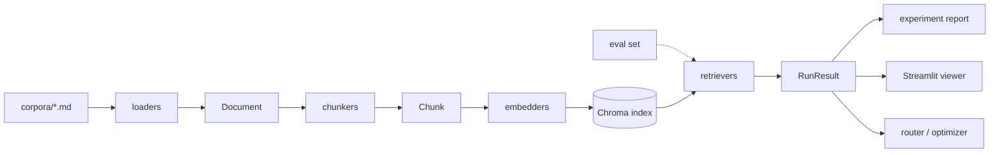

# rag-lab

A framework for showcasing chunking and embedding strategies, with an agentic
optimization layer.

**Status: Phases 0–9 complete.** The one remaining stub is Phase 5's
LLM-based eval-set *generator* (`evalset build/validate/stats/review`) —
Phase 6 onward uses a hand-authored substitute
(`scripts/build_api_docs_evalset.py`) in its place; see "Four things worth
knowing" below. `make demo` is the fastest way to see all of it work
together end to end.

The skeleton, artifact schemas, config system, CLI surface and health check
are in place (Phase 0). Five corpora — `api_docs`, `contracts`, `filings`,
`transcripts`, `catalog` — are curated and load cleanly into normalized
`Document` artifacts, with stats showing each corpus exhibits the property
it was chosen to stress (Phase 1). Four baseline chunkers — `fixed`,
`recursive`, `markdown`, `sentence_window` — turn those documents into valid
`Chunk` streams, with `chunk stats`/`show`/`diff` to inspect what each one
did; on `api_docs`, `markdown` never splits a fenced code block while
`fixed` routinely does (Phase 2). Four embedders behind a common asymmetric
query/document protocol build persistent, cached Chroma indexes (Phase 3).
Five retrievers — `dense`, `bm25`, `hybrid` (RRF), `parent_doc`,
`sentence_window` — run and compare against those indexes, with BM25
beating dense on exact-identifier queries (Phase 4). The evaluation harness
expands a chunker x embedder x retriever experiment matrix, resolves gold
labels from document-offset spans per chunk set, and reports recall/MRR/
nDCG with bootstrap confidence intervals — `markdown` beats `fixed` on real
`api_docs` recall@5 outside the CI at a small enough window, and ties on
recall@5 while returning 3.4x fewer tokens per correct answer at the demo's
default window (Phase 6; see `docs/findings.md`). Two advanced chunkers
round out the registry: `semantic` cuts on embedding-distance breakpoints
between sentences (measured 55x more expensive to build on code-punctuated
`api_docs` than on `transcripts`, for a comparable document count — both
results are shown, not just the win) and `table_summary` pulls GFM tables
out of `filings` into their own chunk with an LLM-generated summary in
`embed_text`, raw table in `text`, cached by table content and mockable with
`--mock-llm` for credential-free testing (Phase 7). Two agents — a router
that picks a retrieval strategy per query and justifies it, and an optimizer
that iterates chunker/embedder/retriever proposals against a held-out dev
split before reporting once on test — are both runnable credential-free via
`--mock-llm` (Phase 8). A four-page Streamlit explorer — chunk boundaries,
retrieval comparison, results dashboard, optimizer trace — degrades to the
committed fixtures whenever `artifacts/` is empty (Phase 9).

---

## Quick start

```bash
python -m pip install -e ".[core,dev]"   # ~15s, no torch
rag-lab doctor                           # environment health check
make verify-phase-0                      # full Phase 0 acceptance run
rag-lab corpus build --all               # load all 5 corpora -> artifacts/documents/
rag-lab corpus stats                     # token distribution, headings, code, tables, lang mix
make verify-phase-1                      # full Phase 1 acceptance run
rag-lab chunk run --corpus api_docs --chunker markdown --params max_tokens=128
rag-lab chunk run --corpus api_docs --chunker fixed --params chunk_tokens=128 --params overlap_tokens=32
rag-lab chunk diff --a <chunk_set_a> --b <chunk_set_b> --doc-id <id>   # the persuasive one
make verify-phase-2                      # full Phase 2 acceptance run

python -m pip install -e ".[core,dev,embed]"   # adds sentence-transformers, chromadb, rank-bm25
rag-lab index build --chunk-set <chunk_set_id> --embedder bge-small
make verify-phase-3                      # full Phase 3 acceptance run
rag-lab retrieve compare --index-id <id> --retrievers dense,bm25,hybrid --query "..."
make verify-phase-4                      # full Phase 4 acceptance run

python scripts/build_api_docs_evalset.py            # hand-authored eval set (Phase 5 stand-in)
rag-lab experiment run --config config/experiments/smoke.yaml
rag-lab experiment report --run-id <run_id>          # metrics table with bootstrap CIs
make verify-phase-6                      # full Phase 6 acceptance run

rag-lab chunk run --corpus transcripts --chunker semantic       # needs .[embed]
rag-lab chunk run --corpus filings --chunker table_summary --mock-llm  # no API key needed
make verify-phase-7                      # full Phase 7 acceptance run

python -m pip install -e ".[core,dev,embed,agents]"   # adds anthropic
rag-lab agent route --query "..." --corpus api_docs --mock-llm --explain
rag-lab agent optimize --corpus api_docs --max-iterations 6 --mock-llm
rag-lab agent trace --run-id <id>
make verify-phase-8                      # full Phase 8 acceptance run

python -m pip install -e ".[core,dev,embed,agents,app]"   # adds streamlit, plotly
streamlit run src/rag_lab/app/Home.py    # chunk boundaries, retrieval comparison, results, optimizer trace
make verify-phase-9                      # full Phase 9 acceptance run

make demo                                # the ten-minute path: builds api_docs, runs the
                                          # demo matrix, launches the viewer -- <5 min, no API key
make verify-phase-10                     # full Phase 10 acceptance run
```

`core` is deliberately light — no PyTorch, no ChromaDB. Phases 1, 2 and 5
(with `--mock-llm`) run on it alone, as does `table_summary` with
`--mock-llm`. Install `.[embed]` for Phases 3, 4, 6 and `semantic`. Install
`.[agents]` (or set `ANTHROPIC_API_KEY`) for `table_summary` without
`--mock-llm`.

## Results

`fixed` vs `markdown` on `api_docs` (`bge-small`, `dense`, `k=10`, the real
30-pair hand-authored eval set) — reproduce with `make demo`, run_id
`demo__20260826T030253Z`:

| chunker | recall@5 | recall@10 | mrr | ndcg@10 | chunk_efficiency |
|---|---|---|---|---|---|
| `fixed` | 1.000 [1.000, 1.000] | 1.000 [1.000, 1.000] | 0.917 [0.850, 0.983] | 0.938 [0.889, 0.988] | 3321.0 |
| `markdown` | 1.000 [1.000, 1.000] | 1.000 [1.000, 1.000] | 0.928 [0.856, 0.983] | 0.938 [0.884, 0.984] | **980.5** |

Recall@5/@10 tie (the eval set saturates both at this corpus size);
`markdown` returns **3.4x fewer tokens per correct answer**. Full table,
the fence-splitting punchline, the `semantic`/`table_summary` cost numbers,
and the honest limitations behind all of it: [`docs/findings.md`](docs/findings.md).

## Architecture



Every arrow is an on-disk artifact with a frozen schema (`src/rag_lab/schemas.py`)
— no phase imports another phase's runtime state. See "The independence
contract" below.

## The independence contract

Every phase is runnable on its own. That is enforced architecturally, not by
convention:

1. **Phases communicate only through on-disk artifacts** with frozen schemas
   (`src/rag_lab/schemas.py`). No phase imports another phase's runtime state.
2. **Every phase ships fixtures.** `fixtures/` holds a small, valid, committed
   example of every artifact any phase consumes, so a phase works on a clean
   checkout with no prior phase ever having run.
3. **Every phase has one verification command** that exits non-zero on failure:
   `make verify-phase-N`.

`paths.resolve_artifact()` is what implements this — it returns the real artifact
when it exists and the fixture otherwise, logging a loud warning on fallback.
The warning matters: silently benchmarking a 12-record fixture would produce
plausible-looking, meaningless numbers.

## Layout

```
config/          default.yaml + experiment matrices
corpora/         5 curated corpora (Phase 1) — api_docs, contracts, filings,
                 transcripts, catalog, each with a SOURCE.md
docs/            strategies.md, adding_a_chunker.md, findings.md, demo_script.md
fixtures/        committed sample artifacts — the independence contract
  raw/           source markdown the fixtures are generated from
artifacts/       generated output (gitignored)
scripts/         build_fixtures.py, build_index_fixture.py,
                 build_api_docs_evalset.py, print_demo_winner.py
src/rag_lab/
  schemas.py     frozen artifact models — the interface contract
  ids.py         deterministic IDs
  config.py      YAML loading + params_hash (the entire caching strategy)
  paths.py       artifact resolution with fixture fallback
  jsonl.py       strict JSONL read/write
  normalize.py   the one text-normalization routine (normalize before offsets)
  markup.py      shared heading/code-block/table detection, fence-masked
  loaders/       Loader protocol, MarkdownLoader, TextLoader (Phase 1)
  corpus.py      corpus stats, document lookup, stats rendering (Phase 1)
  chunkers/      Chunker protocol, finalize_chunks, fixed/recursive/markdown/
                 sentence_window, name registry, build_chunk_set (Phase 2);
                 semantic, table_summary (Phase 7)
  chunks.py      chunk-set stats, lookup, boundary/diff rendering (Phase 2)
  llm.py         one-shot LLM call + on-disk response cache, --mock-llm
                 support (Phase 7) -- not agents/, which is Phase 8's
                 tool-use loop
  embedders/     Embedder protocol, SentenceTransformerEmbedder, model
                 registry (asymmetric query/doc prefixes) (Phase 3)
  stores/        VectorStore protocol, ChromaStore (Phase 3)
  indexing.py    index build/cache/load/search orchestration (Phase 3)
  retrievers/    Retriever protocol, dense/bm25/hybrid/parent_doc/
                 sentence_window, name registry (Phase 4)
  retrieval.py   retriever run/compare orchestration (Phase 4)
  evalset/       load_evalset — the read-only slice of Phase 5 that Phase 6
                 depends on; generation/validation still stubbed
  metrics/       recall/MRR/nDCG, gold resolution, bootstrap CI (Phase 6)
  experiment/    matrix config + expansion, the runner, reporting (Phase 6)
  agents/        tool-use loop, router, optimizer (Phase 8)
  app/           Streamlit explorer -- Home.py + pages/ (Phase 9)
  doctor.py      environment health check
  cli.py         Typer app, one sub-app per phase
tests/           one test module per phase
```

## Four things worth knowing before extending this

**`Chunk.text` vs `Chunk.embed_text`.** One field is returned to the consumer,
the other is embedded. Heading-path prefixing, asymmetric query/document
prefixes, table summary-indexing and parent-document retrieval are all
expressible through that single split without special-casing any of them
downstream. Do not collapse the two fields.

**Gold labels are document character offsets, never chunk IDs.** A label
expressed as a chunk ID is only valid for the chunk set that produced it, which
would make chunker comparison circular — the exact thing this project exists to
measure. `EvalPair.gold_char_spans` is authoritative (a list — most pairs carry
one span, `cross_reference` pairs carry two or more distant spans in the same
document, each resolved to gold chunks independently); `sampling_chunk_ids` is
derived provenance from generation-time sampling and is re-resolved per chunk
set at evaluation time. `metrics.gold.resolve_gold_per_span` is that
re-resolution, per span rather than against their union — a `cross_reference`
pair's spans are scored independently so a chunk sitting between two distant
spans never becomes gold for either.

**Phase 5 isn't built yet, so Phase 6 has its own eval-set shortcut.**
`scripts/build_api_docs_evalset.py` hand-authors ~30 needle-anchored pairs
against the real `api_docs` corpus (the same technique
`scripts/build_fixtures.py` uses for its committed fixture, scaled up) and
writes a real `artifacts/evalset/api_docs.jsonl` — exactly the "hand-written
eval set" shortcut this plan's own Sequencing section names as the
minimum-viable path to Phase 6. Every other corpus still falls back to the
shared fixture bundle. Mixing a *real* chunk set with a still-fixture eval
set for the same corpus describes two disjoint document universes and
resolves every pair's gold to zero chunks — `experiment run` logs this as
`cell_fully_excluded` rather than silently reporting empty metrics.

**A runtime mode that changes output data is a hashed param, not a bypass.**
`table_summary`'s `mock_llm` looked at first like a pure test-mode switch that
shouldn't affect `chunk_set_id` — but a mock run and a real run produce
materially different `embed_text` (placeholder vs. real summary), so hashing
it in (default `False`, like any other chunker param) is what stops a real
`chunk run` after an earlier `--mock-llm` run from silently reading back
cached mock output as a legitimate cache hit. The tell: if two configs can
produce different bytes on disk, they need different IDs — the same rule
`role`/`parent_chunk_set_id` follow (§4.7).

**`make demo` regenerates the `api_docs` eval set at demo-time rather than
shipping a second, committed copy under `fixtures/evalset/`.** The plan's
Step 10.1 literally describes "shipping a pre-generated eval set... in
`fixtures/evalset/`" — `make demo` instead runs
`scripts/build_api_docs_evalset.py` (the same script `verify-phase-6/8/9`
already use), which needs no network, no API key, and under a second to
regenerate deterministically from the already-committed `corpora/api_docs/`
source files. A hand-copied `fixtures/evalset/api_docs.jsonl` would drift
the moment a corpus document or a seed changed, and that drift fails
*silently* (every pair excluded, logged as `cell_fully_excluded`) rather
than loudly — worse than the literal spec text being technically unmet. See
`docs/findings.md` §5 for the related limitation this substitute carries.

## Caching

Every artifact ID embeds the hash of the parameters that produced it
(`config.params_hash`). A changed parameter yields a new ID and therefore a cache
miss; unchanged parameters yield a hit. There is no cache invalidation logic
anywhere in the system, by design.

Key order never affects the hash, and annotation keys (`description`, `comment`,
`note`, plus anything listed in a local `_nohash`) are excluded — so you can
document a config without invalidating every cached artifact.

## CLI

```bash
rag-lab --help                    # every phase, stubs included
rag-lab doctor                    # environment check
rag-lab config                    # fully resolved configuration
rag-lab --set seed=7 config       # override resolution: --set > --config > default.yaml
rag-lab corpus build --all        # load corpora/<name>/ -> artifacts/documents/<name>.jsonl
rag-lab corpus build --corpus api_docs
rag-lab corpus stats              # per-corpus token/heading/code/table/language stats
rag-lab corpus show --doc-id <id> --chars 500
rag-lab chunk run --corpus api_docs --chunker markdown --params max_tokens=512
rag-lab chunk stats --chunk-set <chunk_set_id>    # split code blocks/tables, orphan rate, ...
rag-lab chunk show  --chunk-set <id> --doc-id <id>  # boundaries as rules in the terminal
rag-lab chunk diff  --a <chunk_set_a> --b <chunk_set_b> --doc-id <id>

rag-lab index build --chunk-set <chunk_set_id> --embedder bge-small
rag-lab index build --chunk-set <chunk_set_id> --embedder bge-small --truncate-dim 256
rag-lab index list
rag-lab index search --index-id <id> --query "how do I paginate?" --k 5

rag-lab retrieve query   --index-id <id> --retriever hybrid --query "..." --k 5
rag-lab retrieve compare --index-id <id> --retrievers dense,bm25,hybrid --query "..." --k 5

rag-lab experiment run --config config/experiments/smoke.yaml       # prints a run_id
rag-lab experiment run --config <cfg> --run-id <id> --workers 4     # resume an interrupted run
rag-lab experiment report --run-id <id>                             # table with bootstrap CIs
rag-lab experiment report --run-id <id> --format markdown
rag-lab experiment compare --run-ids <a>,<b>
rag-lab experiment failures --run-id <id> --config-idx 0 --n 20     # worst queries for one cell

rag-lab chunk run --corpus transcripts --chunker semantic
rag-lab chunk run --corpus filings --chunker table_summary                 # real LLM calls
rag-lab chunk run --corpus filings --chunker table_summary --mock-llm      # no API key needed

rag-lab agent route --query "..." --corpus api_docs --explain              # real LLM call
rag-lab agent route --query "..." --corpus api_docs --mock-llm --explain   # no API key needed
rag-lab agent optimize --corpus api_docs --max-iterations 6 --budget-usd 5 --mock-llm
rag-lab agent trace --run-id <id>

streamlit run src/rag_lab/app/Home.py   # chunk boundaries, retrieval comparison, results, optimizer trace
```

The one remaining stub is Phase 5's `evalset build/validate/stats/review`
(it exits 1 and names itself) — see `scripts/build_api_docs_evalset.py` for
its working substitute.

## Requirements

Python 3.10+. No GPU, Docker, database or search service. An `ANTHROPIC_API_KEY`
is needed for Phases 5, 7 (`table_summary`) and 8 only, and all three support
`--mock-llm` for testing without one.

## License

MIT.
